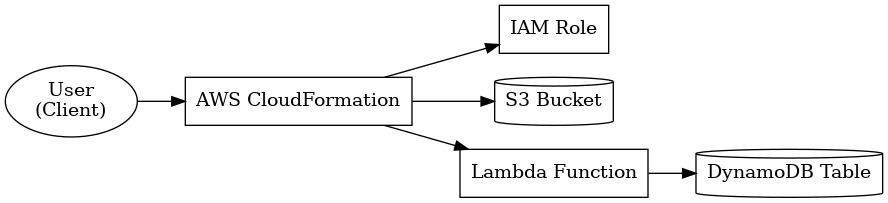
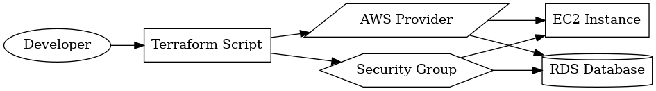

# Use Cases

- Move files between S3 buckets automatically.
- Parse and stream logs to DynamoDB or Redshift.
- Launch SageMaker ML training jobs from event triggers.

## Architecture Diagrams

### CloudFormation

### Terraform

